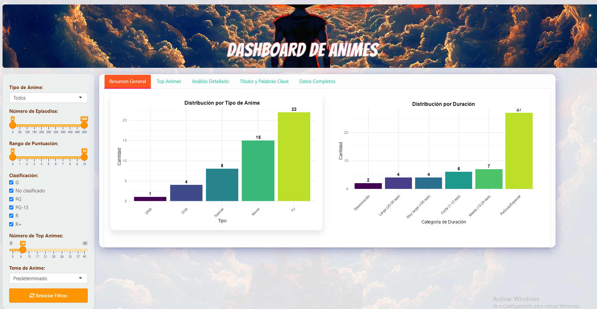

# 🎌 Anime Analytics Dashboard | Shiny & R

[](https://www.r-project.org/)
[](https://shiny.rstudio.com/)

> 📚 **Proyecto académico**  
> Dashboard interactivo desarrollado como ejercicio práctico para la materia **Ciencia de Datos** de la  
> **Tecnicatura en Ciencias de Datos**, con tema de libre elección.

Un dashboard interactivo para explorar estadísticas de "Anime.csv" con visualizaciones dinámicas y múltiples temas visuales inspirados en populares series como Naruto, Dragon Ball y Attack on Titan.

## 🔗 Puedes probar el dashboard directamente en tu navegador: [Demo Online](https://nicolas-mesquiatti.shinyapps.io/Dashboard-Anime/)



## ✨ Características Principales

### 🎨 Temas Visuales
- 6 paletas temáticas (Naruto, Dragon Ball, One Piece, etc.)
- Cambio dinámico de colores y estilos CSS
- Efectos visuales personalizados para cada tema

### 📊 Visualizaciones Interactivas
- Gráficos con Plotly (zoom, selección, tooltips)
- Nube de palabras de títulos
- Scatter plots comparativos (rating vs popularidad)
- Tablas filtrables con búsqueda y paginación

### ⚙️ Funcionalidades Avanzadas
- Filtros interconectados (tipo, episodios, puntuación)
- Diseño responsive para móviles y tablets
- Efectos hover y transiciones CSS

## 🛠 Stack Tecnológico

| Categoría         | Tecnologías                              |
|-------------------|------------------------------------------|
| **Framework**     | Shiny, shinyjs                           |
| **Visualización** | ggplot2, plotly, wordcloud               |
| **Datos**         | dplyr, forcats, scales                   |
| **UI/UX**         | shinythemes, CSS3 personalizado          |

## 📦 Instalación y uso
### Requisitos previos
- R (>= 4.0.0)
- RStudio (recomendado)

### Pasos para ejecutar

1. Clonar el repositorio:
```bash
git clone https://github.com/tu-usuario/anime-dashboard.git
cd anime-dashboard
```
2. Instalar dependencias
```bash
install.packages(c("shiny", "ggplot2", "dplyr", "DT", "plotly", "wordcloud", 
                  "tm", "RColorBrewer", "shinythemes", "shinyjs", "forcats",
                  "scales", "ggthemes"))
```
4. Ejecutar la aplicación
```bash
shiny::runApp()
```
## 🎛️ Módulos Principales

| Pestaña            | Contenido                                                                 |
|--------------------|--------------------------------------------------------------------------|
| **Resumen General**  | • Distribución por tipo<br>• Categorización por duración                |
| **Top Animes**       | • Top 10/20/30 por rating<br>• Popularidad por miembros                |
| **Análisis Detallado**| • Scatter plot interactivo<br>• Tabla de selección                     |
| **Títulos**          | • Nube de palabras<br>• Frecuencia de términos                         |
| **Datos Completos**  | • Tabla filtrable con búsqueda                                         |

## 🎨 Temas Visuales

El dashboard incluye 6 paletas de colores inspiradas en:

- **Naruto** (naranja/azul)
- **Dragon Ball** (amarillo/naranja)
- **One Piece** (rojo/azul)
- **Bleach** (negro/rojo)
- **Attack on Titan** (gris/rojo oscuro)
- **Predeterminado** (escala Viridis)

Cada tema cambia dinámicamente:
- Colores de gráficos
- Fondos y headers
- Estilos CSS completos

## 📝 Notas Importantes

### 🗃 Dataset Limitado
El archivo `Anime.csv` actual contiene principalmente datos de la serie **Naruto**, lo que implica:

⚠️ **Limitaciones actuales:**
- Los resultados de análisis pueden estar sesgados hacia esta serie
- La mayoría de visualizaciones mostrarán predominancia de esta franquicia
- Las estadísticas generales no representan el universo completo de anime

